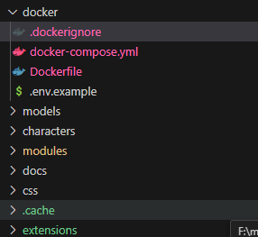

# Git File Highlight for Visual Studio Code
### Git File Highlight is a Visual Studio Code extension that highlights files in your explorer view that have changed based on specific Git references.


## Features

- Highlight files changed between any two commits, branches, or tags.
- Customizable color highlighting for up to three different refs.
- Easy configuration through VSCode settings.

## Getting Started

1. Install the extension from the Visual Studio Code Marketplace.
2. Open your VSCode settings and navigate to the "Git File Highlight" section.
3. Configure the Git references (`ref1`, `ref2`, `ref3`) you want to track.
4. Assign colors to each ref to distinguish between them in the file explorer.

## Usage

Once you have configured the refs and their corresponding colors, the extension will automatically highlight the files that have changed according to the specified refs.

## Configuration

Here's a sample configuration for your `settings.json`:

```json
"gitFileHighlight.ref1": "HEAD",
"gitFileHighlight.ref2": "origin/main",
"gitFileHighlight.ref3": "feature-branch"
```

Feedback
If you have suggestions or issues, please feel free to open an issue on GitHub.

Contributing
Pull requests are welcome. For major changes, please open an issue first to discuss what you would like to change.

License
MIT License